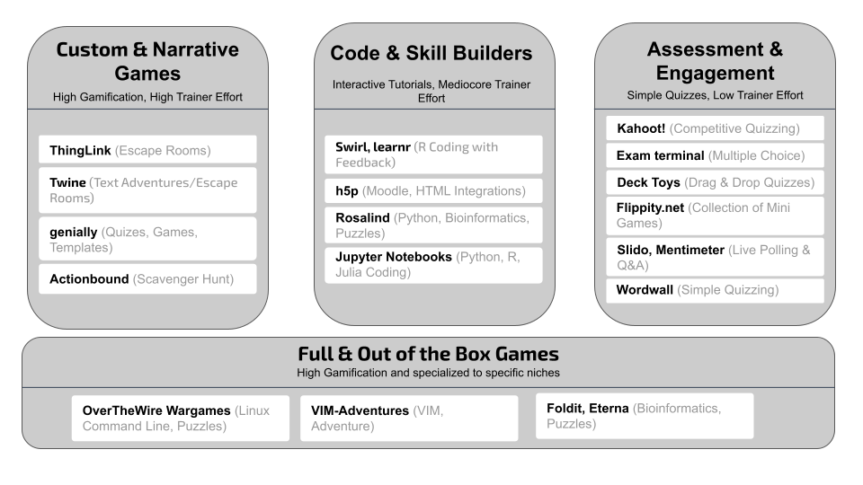
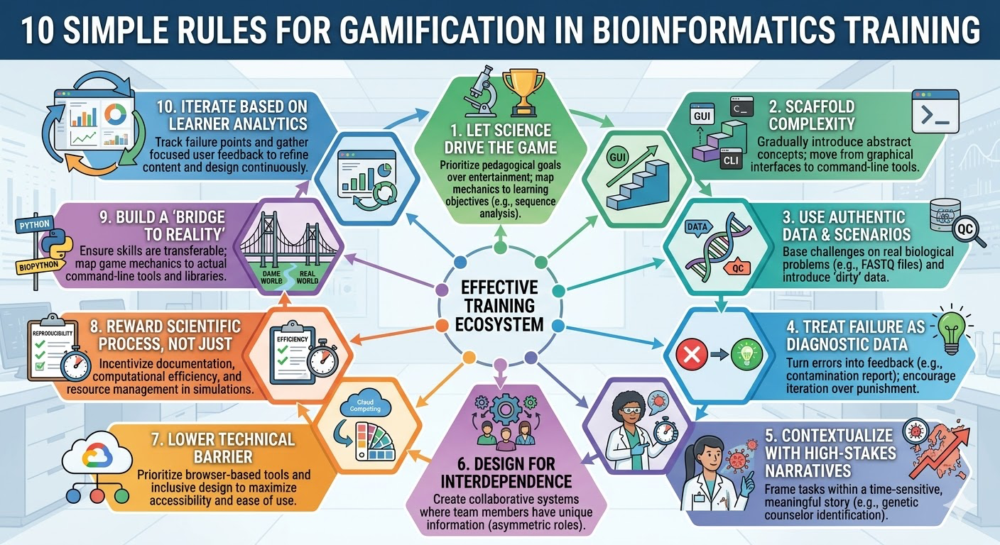
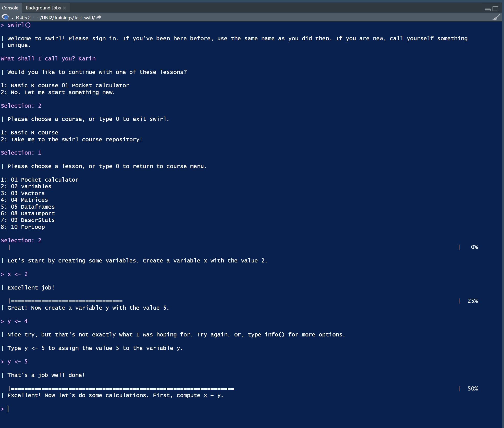
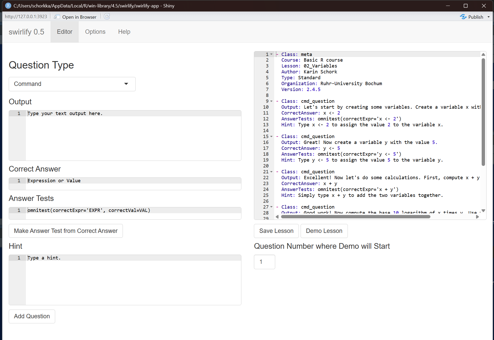

# Abstract

State of the art life science training features steep learning curves due to dense technical specifications and complex data formats, often causing cognitive overload and low learner retention. While gamification can enhance engagement, implementing it without trivializing scientific content remains challenging. As part of the Biohackathon Germany 2025, we explored strategies to adapt gamification for bioinformatics education. We curated a resource matrix evaluating 20 digital tools based on cost, implementation effort, and pedagogical impact. To guide instructors, we formulated the "Ten Simple Rules for Gamification in Bioinformatics and Life Sciences Education," emphasizing a shift from superficial point systems to deep, competency-driven mechanics rooted in authentic data and high-stakes narratives. We validated this framework through two pilot implementations: translating an introductory R programming course into interactive console tutorials using swirl accelerated by Large Language Models (LLMs), and deploying browser-based Research Data Management (RDM) quizzes via Wordwall to reinforce FAIR principles. Our findings reveal that while specialized tools fit specific niches easily, broader open-source frameworks offer greater flexibility, with implementation workloads significantly mitigated by generative AI workflows. Ultimately, gamification serves as a powerful pedagogical asset when balanced correctly, transforming abstract computational workflows into engaging, collaborative simulations that bridge virtual training and professional scientific competency.

# Introduction

Gamification is the process of applying game-design elements and game principles in non-game contexts to make activities more engaging and motivating. This often includes the use of points, badges, leaderboards, levels, and other game mechanics to drive desired behaviors [@citesAsAuthority:deterding_game_2011]. Gamification has been successfully implemented in education and training, leading to a higher engagement and motivation of the learners [@citesAsAuthority:zeybek_gamification_2024]. However, different stages of gamification exist, from simple quizzes over interactive training sessions to whole games or escape rooms that are laborious to develop. Some techniques may be suited for face-to-face courses to encourage and maintain motivation, while others are more suited for online courses or self-learning material. For different stages a wide variety of tools exist, which makes it even more difficult to decide which tool to use. In de.NBI, the German Network for Bioinformatics Infrastructure, many training courses on different aspects of bioinformatics and life sciences are conducted each year [@citesAsRelated:wibberg_nbi_2020] [@citesAsRelated:mayer_implementing_2021]. At the de.NBI Biohackathon Germany 2025 our aim in the project “Exploring Gamification Strategies to Enhance Bioinformatics Training” was to explore the possibilities and challenges in adapting gamification aspects for bioinformatics training courses. We assembled a list of gamification tools, developed ten simple rules for gamification in bioinformatics and life science education and provided examples on our experiences while adding gamification aspects into our training courses.

# Overview of available gamification tools 

An overview table of gamification tools was generated as a practical guide for trainers (see Supplementary Table 1). It is a curated table of gamification tools considered during our hackathon project. 20 tools are described here, from free tools, to paid only tools, effort information, small examples and our impressions. We created this table by compiling various tools suitable for gamifying workshops or training sections. This selection and evaluation are based on our impressions of these tools (and in some cases the first practical impressions), combined with our background knowledge in training and workshops, both as trainee and trainer. Since gamification in workshops and training provides an engaging concept to enhance learning, we therefore provide this overview table as a resource for trainers and workshop leaders, who seek to implement gamification tools and to increase engagement. 

Table 1: Brief description of the columns used in Supplementary Table 1. This table provides a brief introduction and the authors understanding of each column on which the gamification tools are described.

| Column                | Brief Description                                                         |
| ----                  | ----                                                                      |
| Tool                  | The gamification tool                                                     |
| Short Description     | Brief description of the tool itself                                      |
| Open Source           | Is this tool open source?                                                 |
| Costs                 | Pricing information                                                       |                                                 
| Platform              | The platform this gamification tool uses                                  |
| Sharing               | Information on how this tool is shared with other trainees                |
| Level of Gamification | Information of what can be gamified with this tool                        |
| Effect on Trainees    | The effect that might occur on the trainees, while using this tool        |
| Game Elements         | Elements that can be used for gamification or can be gamification-like    |
| Specialization        | Information how broadly applicable this tool is                           |
| Context               | In which context we assume this tool fits best in training.               |
| Effort for Trainers   | Classification into Low / Medium / High effort with a short description   |
| Player Types          | What kind of player types can be targeted with this tool                  |
| Examples              | Example Link of an online available resource                              |
| Tool Website          | Link to the tool itself                                                   |
| First Impressions     | Subjective impressions of the authors                                     |

The table columns were specifically selected to highlight the most crucial information about each tool.  Specifically, we include tool names alongside a reference, such as a website. Further, we provide a brief description, detailing cost and open source availability. To address training-specific needs, we indicate how and when a gamification tool can be used, which effect it has on trainees and in which context it can be used. An explanatory table (Table 1) provides a complete list of these columns with a brief description. By structuring this data in this way, we aim to give trainers a quick overview and the necessary guidance to evaluate which tools may fit best for their training.

We included a broad range of available gamification tools. Initially, the table was populated with gamification tools we had previously used or encountered. Further, we complemented the table individually, with online searches, to expand the selection. In total, 20 different gamification tools were collected and integrated into this table. Through our varied experience and individual search strategy, we captured a curated landscape of both popular and lesser-known tools, providing a profile of the options available today. This curated table serves as a selected resource and knowledge base for the trainers.

Gamification tools can be broadly divided into several distinct sub categories. Looking at our landscape of gamification tools, it is apparent that they offer varied pricing tiers. Interestingly, 12 of 20 tools are free, while 7 fall into the "Freemium" category (requiring payment for advanced features) and 1 operates exclusively on paid subscriptions. Also, all open source tools in our list are free. Another important distinction lies in player types. Some tools are targeted for competitive individuals (such as a scoring based mechanism across individuals), while others are designed for solo exploratory experiences, like puzzle solving (e.g. escape rooms) or are self-paced (e.g. interactive coding with direct feedback). Almost all collected gamification tools are web-based (15), allowing access via computer with some gamification tools (e.g. Mentimeter) being available for mobile and desktop use. Few other tools are specialized and integrated in other software (e.g. R-console or command line). This table highlights that gamification tools are highly diverse and heavily dependent on the specific use case, demonstrating that they cannot be summarized in a single general overall category.

Digging deeper into the table, these tools can be further categorized by their required effort and their engagement level. Trainers need to know how much effort is required to include gamification elements as well as the possible impact of engagement on their trainees. Since many of these tools are highly customizable, both effort and engagement can vary. We classified these tools based on our best estimates. Figure 1 illustrates our classification into three distinct groups: High, Medium and Low Effort for Trainers. Additionally, gamification tools, which cannot be modified are shown below to be used as is, if fitting to a training. Additionally, gamification tools, which cannot be modified are shown below to be used as is, if fitting to a training. Using this figure, trainers can roughly gauge the necessary effort and expected engagement for various gamification tools. 

To further clarify the implementation workload, an effort column is included in the table.   
As all gamification tools are unique and some are even highly customizable, we estimated the effort based on how easily the tool integrates into a training program. It should be noted that factors such as payment plans, openness, flexibility and user interface can make this estimation subjective. Notably, the effort required for almost any tool can range from low to high, depending on the depth of gamification a trainer wishes to achieve. Tools, like Kahoot\! or ThingLink, can reduce implementation effort by utilizing AI or other guided elements, such as templates. Conversely, some gamification tools like OverTheWire Wargames are designed for niche audiences, requiring almost no implementation effort, with the trade off to limit its utility for broader training contexts. Through this column and the comprehensive table we hope trainers can make an informed decision about whether to incorporate gamification tools and, if so, which ones best suit their specific needs. 

# Ten Simple Rules for Gamification in Bioinformatics and Life Sciences Training

In this hackathon, we formalized rules that serve as a comprehensive framework for developing gamification training modules, which are both engaging and scientifically robust. They emphasize a shift from superficial "points-based" systems to deep, competency-driven mechanics that respect the complexity of biological data. From the initial spark of a high-stakes narrative to the final "bridge to reality" that maps game actions to professional Python libraries or command-line tools, these rules aid that the training remains grounded in professional practice. 

**Rule 1: Let the Science Drive the Game**

The didactical objective must always outweigh the entertainment factor in life sciences education. Instructors should explicitly map game mechanics to the specific cognitive skills they intend to teach, such as sequence analysis or statistical inference. By aligning mechanics to Bloom’s Taxonomy [@citeAsRelated:bloom_taxonomy_1956] , using simple trivia for knowledge recall and open-ended design challenges for synthesis, the "win condition" remains a successful demonstration of scientific mastery. Avoiding distracting fluff ensures that points and badges directly support the core biological concept rather than overshadowing it.

### **Rule 2: Scaffold the Complexity**

Structure the learning journey to gradually introduce the demanding intellectual material characteristic of bioinformatics. Applied to non-technical users, training should begin with highly constrained, graphical user interface (GUI) tasks to build confidence in basic bioinformatics before moving towards more abstract concepts. Progressively introducing command-line interface (CLI) or scripting elements once the conceptual foundation is secure prevents cognitive overload. Utilizing tiered levels of difficulty where mastering a basic skill unlocks an advanced one provides a clear path toward professional competency.

### **Rule 3: Use Authentic Data and Scenarios**

Engage trainees by anchoring the game around realistic biological problems using data that reflects real-world challenges. Incorporating actual public domain files from sources like FASTQ, mzML, FASTA mzTAB, PDB, or GEO series familiarizes trainees with the volume and formats they will encounter in their research. Building scenarios where data is "dirty" or contains missing values forces participants to perform essential pre-processing and quality control. This approach ensures that trainees learn with data that mirrors real-life scenarios outside of this training.

### **Rule 4: Treat Failure as Diagnostic Data**

Leverage the high failure rate inherent in research by making mistakes an integral part of the learning cycle rather than punitive actions. When a trainee makes a technical or conceptual error, the gamification tool should provide immediate diagnostic feedback, such as engaging messages about the trainee’s success. Normalizing iteration through mechanics that encourage repeated attempts with low costs, such as quick resets or a testing sandbox environment. Eliminating severe penalties prevents demoralization and focuses the trainee's energy on continuous learning.

### **Rule 5: Contextualize with High-Stakes Narratives**

Frame the scientific task within a compelling story to drive intrinsic motivation and provide a purpose for detailed analysis. Presenting a puzzle as a time-sensitive crisis, such as identifying a virulence factor before a disease spreads, transforms a standard exercise into a mission. For example, assigning meaningful roles like "Field Virologist" or "Lead Bioinformatician" connects the player's actions to a professional career path. Visualizing the impact of a successful analysis through satisfying consequences in the game world reinforces the value of the work. However, you should take care that too much pressure can also be counterproductive.

### **Rule 6: Design for Interdependence**

Foster collaboration by creating gamification tools where no single trainee possesses all the necessary knowledge or tools to succeed alone. Implementing asymmetric roles ensures that different team members hold unique pieces of information, forcing them to communicate effectively to solve the problem. Designing cooperative missions rewards the team for teaching difficult concepts to struggling members, mirroring the interdisciplinary nature of modern science. Using cooperative scoring based on reproducibility metrics or collective achievement shifts the focus from individual competition to team success.

### **Rule 7: Lower the Technical Barrier to Entry**

Prioritize accessibility and ease of setup to ensure trainees spend their time learning biological concepts rather than troubleshooting software dependencies. Utilizing browser-based platforms and cloud-based computing eliminates local installation conflicts and resource requirements that often derail workshops. Adopting inclusive design principles, such as color-blind friendly palettes for heatmaps and phylogenetic trees, ensures the materials are accessible to all. Providing a consistent, pre-configured virtual environment like a standardized Jupyter instance allows for a seamless start to the training.

### **Rule 8: Reward Scientific Process, Not Just Answers**

Recognize the value of rigor, methodology, and efficiency, which are critical in professional scientific practice. Incentivizing reproducibility by awarding bonuses for documented code and well-maintained experimental logs teaches the importance of Open Science. Acknowledging code efficiency through scoring based on computational cost or run-time encourages the use of optimized algorithms. For example, tracking resource management within simulation games rewards trainees who effectively manage virtual lab budgets and reagent stocks, preparing them for real-world lab management.

### **Rule 9: Build a "Bridge to Reality"**

Ensure that the skills and knowledge gained within the game environment are readily transferable to the trainee's future professional work. Implementing a reflection phase after each game segment allows for an explicit discussion on how game mechanics map to real-world scientific protocols. For example, providing the actual command-line syntax or Python functions used in professional libraries, such as Biopython or scikit-learn, bridges the gap between the game and the bench. Rewarding completion with transferable resources like code templates and analysis checklists provides immediate value to the trainee’s research.

### **Rule 10: Iterate Based on Learner Analytics**

Use the quantitative and qualitative data generated by the gamification tool to continuously refine the curriculum and the game design itself. Tracking specific failure points where trainees spend the most time or frequently quit helps identify areas of high cognitive load or poor instruction. Gathering focused feedback on the relevance of the scenarios and the difficulty of the science allows for targeted improvements. Conducting A/B testing on different game mechanics, such as comparing a puzzle versus a simulation for a complex concept, ensures the most effective learning outcomes are achieved.

In summary, Gamification in bioinformatics offers a strategic solution to the field’s steep learning curves by transforming abstract computational workflows into engaging, competency-driven simulations. By following these ten rules, trainers ensure that didactical goals remain the primary focus, utilizing authentic data and high-stakes narratives to drive intrinsic motivation while rewarding the scientific process rather than just correct answers. This framework emphasizes accessibility and collaboration, ultimately creating a "bridge to reality" that translates in-game mastery into professional laboratory and coding skills. Through continuous iteration based on learner analytics, these principles help build a more resilient and computationally literate scientific community.

## **Example 1: The de.NBI introductory R course gamified**

One popular de.NBI training course of the BioInfra.prot service center (Bioinformatics for proteomics)  [@citeAsRelated:turewicz_bioinfraprot_2017] is the introductory R course   [“Differential analysis of proteomics data using R”](https://www.denbi.de/online-training-media-library/1172-differential-analysis-of-quantitative-proteomics-data-using-r ). This course is aimed at life scientists starting with [R](https://www.R-project.org/ ), so no preliminary knowledge about programming is required. In the course of this biohackathon project we searched for options to provide interactive tutorials for R, that can be used as online training material for self learning. The main idea is that the learners can independently practice and get direct feedback if their used commands or code is correct. 

The R packages swirl [@usesMethodIn:kross_swirl_2020] and learnr [@usesMethodIn:aden-buie_learnr_nodate] provide the option to generate interactive tutorials. Both packages have similar aims but work differently on the technical side. Learnr builds interactive tutorials based on R Markdown files and Shiny applications, from which  tutorials can be distributed as a web application. The tutorials can be opened in a browser and the trainee can enter and execute R code in interactive fields. Swirl offers a different strategy by having the tutorials directly work inside the R console. As an advantage, trainees directly get to know the R console and the respective IDE like RStudio. On the other hand, learnr offers more possibilities like directly adding video content or Shiny components like interactive graphics. 

We decided to further explore swirl and to transform the already existing hands-on exercises from the introductory R course into swirl. The main idea of a swirl course is the following: the trainee opens R in an IDE like RStudio and after loading the swirl package, the trainee writes the command swirl(). This will enter the interactive tutorial mode (see figure 1). As a first step, the name of the trainee is entered which is used to keep track of progress of the tutorials which can be interrupted  and continued at a later timepoint. The trainee can choose a course, which may consist of multiple lessons and each lesson can consist of multiple questions. There are different question types: 

- Command question (answered by typing an R command into the console)  
- Multiple choice question  
- Figure questions (shows a figure or plot to the trainee)  
- Video / URL question (a link can be opened to further information or a video)  
- Numerical question (answered by typing a number to the console)  
- Text question (answered by typing text to the console)  
- Script question (a .R file opens and a whole script, or parts of it, need to be written as an answer)

Once an answer is provided by the trainee, it is checked by swirl for correctness. For more complicated questions like command or script questions, where also multiple ways for solving may exist, a testing function can be written and provided to check the answer. If the answer was correct, an engaging message (e.g. “Excellent job\!”.) is printed to the console and the next question is displayed. If the answer was wrong, a hint can be displayed and the trainee can try again. If a question is hard to solve, it is also possible to enter a play mode that allows you to try things out in the R console before returning to the course. In the worst case, it is also possible to skip a question.

For setting up the course, we used the package swirlify [@usesMethodIn:kross_swirlify_2019], which provides a GUI to enter questions and edit swirl courses (see figure \ref{fig4}). On the left-hand side, the question type can be chosen and entered together with the correct answer, testcode for the trainees answers and hints. On the right-hand side, the underlying .yaml file for the lessons can be edited and a “Demo lesson” can be started for testing and debugging.

As we want to “swirlify” already existing course material, the usage of large language models seems to be an obvious choice. We used [Claude Sonnet 4.5](https://claude.ai/) and uploaded the pdf with the exercises and solutions and asked for each exercise, one by one, to provide the yaml file for swirl, which we later edited within swirlify.   
The finished courses can be easily shared by exporting them to the .swc file format, which can then be installed on a different computer.   
The generated swirl course is available on github at [https://github.com/mpc-bioinformatics/swirl\_R\_course](https://github.com/mpc-bioinformatics/swirl_R_course).

## **Example 2: Establishing an RDM Quiz in Wordwall** 

Research Data Management training often involves dense technical specifications and legal requirements. During BioHackathon Germany 2025, Wordwall ([http://wordwall.net](http://wordwall.net)) was tested to establish an RDM Quiz. To prevent "information overload", the Wordwall platform allows trainers to convert these complex concepts into bite-sized, interactive challenges. By using provided gamified templates, instructors can assess participant progress in real-time while maintaining a high level of energy in the room.

Wordwall’s strength lies in its variety of templates, which can be mapped to different levels of RDM complexity. In our project, a Game Show Quiz was created \- A high-stakes, timed quiz with "Lifelines" and "Double Points" that covers the essential components of RDM.

Using Wordwall aligns perfectly with 8 of 10 gamification principles. It lowers the technical barrier to entry because it is entirely browser-based; participants simply scan a QR code to join on their phones. Furthermore, it allows trainers to treat failure as diagnostic data. After each activity, Wordwall provides a leaderboard and a detailed breakdown of results, allowing the instructor to see exactly which RDM concepts (like persistent identifiers or specific licenses) need further clarification.

To ensure the quiz isn't just "fun", the questions must be anchored in authentic scenarios. For instance, instead of asking "What is CC-BY?", a Wordwall question might present a scenario: *"You want to share your dataset so that others can use it for any purpose as long as they credit you. Which license should you choose?"* This forces the trainee to apply the knowledge to a situation they will face during their work.

Integrating Wordwall into an RDM course transforms the assessment phase from a passive test into a dynamic, social experience. By utilizing diverse game templates, instructors can cater to different learning styles and provide immediate, actionable feedback, ensuring that FAIR principles are not just memorized, but understood and ready for implementation.

# Discussion and Future Direction

In this work, we present a variety of tools and rules to use gamification elements in training. Supplementary Table 1 summarizes  the identified gamification tools. The non-comprehensive list provides information about costs, the available gamification elements, the integration effort and more to provide trainers a first overview. Further, the section ten simple rules describes a framework for integrating gamification elements into training. Here we provide information on what data can be used or how to build scenarios aiding trainers. Both are provided as a first lookup resource for other trainers who consider integrating gamification elements.

In our experience, specialized tools are easier to integrate into training while other broader/general tools are more difficult. We used swirl to gamify the de.NBI introductory R course and Wordwall during the BioHackathon Germany 2025 to gain further practical experience. Based on this knowledge and past experiences as trainees and trainers, we discussed how to further categorize the available tools in Supplementary Table 1. As swirl and Wordwall are very different, it was apparent that flexibility and openness of such tools influence the difficulty of integrating them into training courses. Swirl and learnr are open source and provide a framework for learning the R language. I.e. they are targeting a very specific audience. Wordwall is targeting a more general audience and allowing all kinds of topics for their quizzes. 

The current trend of AI and usage of LLMs for text and image generation, can reduce the workload of including gamified elements into training. Already seen in Supplementary Table 1, some tools fall into the category "Freemium", where a paid subscription or similar enables premium features. The premium features mostly contain the option to use an AI to generate gamification elements. Although these AI generated elements may lack the accuracy, it significantly reduces the first hurdle to get started and also allows for edits to correct or extend generated content. AI can further be used in conjunction with open source gamification tools. We created a swirl course for the de.NBI introductory R course, which needed some adaptation but greatly reduced the effort for the trainers. All in all, current AI tools can be used from within tools if available, and also used outside of tools to generate first drafts and for gamification elements brainstorming.

The amount of gamification elements in training courses needs to be balanced. Trainers need to be aware of how much gamification should be used in their training and on what content it should be applied. Courses can feel childish if too many or wrong elements are used. The audience also needs to be considered as these also affect the balance and gamification elements that can be used (e.g. researchers versus students). We advise to especially pay attention to the ratio of gamification elements used in the training, to find a good timing (e.g. in a midday low or fun ending of the course) and to use a proper framework for it. 

We see gamification elements as a stylistic part in training. Trainers can use these parts to get people on board for their training. Also, the motivation can be increased, and tough training sections can be gamified. We envision that such elements at the end can conclude a fun and well rounded training-session. Further, materials after the training session could motivate trainees to further dive into specific training topics in an engaging way. If this stylistic part is used correctly, gamification elements are a great addition to increase the retention of the training courses' content.

## Funding 
This work was funded by the Core Unit Bioinformatics of the Medical Faculty, Ruhr University Bochum (CUBiMed.RUB) and the Federal Ministry of Education and Research within the framework of de.NBI/ELIXIR-DE (W-de.NBI-001 and W-de.NBI-005).  

